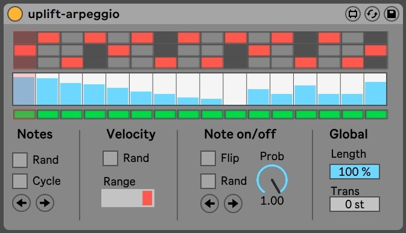

# Uplift Arpeggio

Arpeggiator/sequencer/utility for Ableton Live.

## What? 

This device was designed to automate some of the melody-writing process I use in my own music (mostly uplifting trance). 

* write a nice 3-notes chord progression 
* add the device and use the top grid to create a 1 bar long, 16th notes monophonic sequence from the given notes (the first, second and third rows represent the first, second and third notes of the chord respectively, ordered by increasing pitch). This is basically an arpeggiator, with a little bit more flexibility perhaps. 
* Tweak velocities and select which notes are (or are not) playing using the velocity editor and the little note on/off grid. 

And that's pretty much it really... The remaining controls are just the icing on the cake and allow you to:

* generate random note sequence, velocities or note on/off configuration (most randomisation functionality can be tweaked/constrained e.g. you can select the range of velocities, or the probability of a "note on")
* manipulate the note sequence in different ways e.g. shifting the pattern left/right or cycling vertically (please experiment with that, it's easier to play with than it is to explain!) 
* adjust the global note length 
* transpose the while thing up/down by semitones
